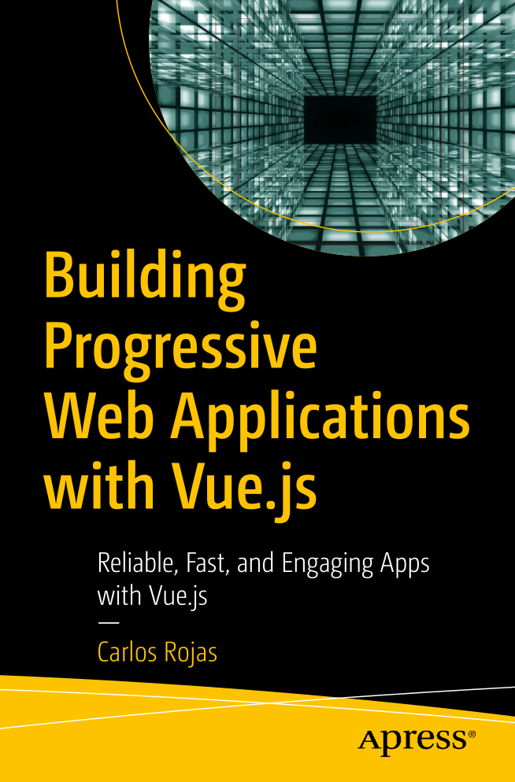

# Building Progressive Web Applications with Vue.js : Reliable, Fast, and Engaging Apps with Vue.js

## Introduction

`From Book`

Progressive web apps (PWAs) were initially introduced by Google in 2015
and proved to bring many advantages to the web platform. In this book, we
are going to examine how to empower our web apps to be fast and reliable,
and to provide an immersive user experience with offline support.

In Chapter 1, we create our first PWA. I guide you in all the steps you
need to know to add offline capabilities and to make a simple web app
a PWA.
In Chapter 2, we take a look at the web app manifest, which is a
simple, but powerful, specification that allows the browsers when can
install a web app like a native app according to the operating system.

In Chapter 3, we study service workers, which are an amazing mechanism to
handle background events with JavaScript.

In Chapter 4, we examine cache
storage and good-practice workflows to keep our offline data updated.

In Chapter 5, we look at the main features and advantages of using Vue.js, a
modern JavaScript framework.
In Chapter 6, we study how to use a database
supported widely in modern browsers, called IndexedDB, and how we can
take advantage of its asynchronous capabilities to empower our PWAs.

In Chapter 7, we look at a simple, but powerful, application programming
interface, called Background Sync, that will allow our app to make the user
experience easy.

In Chapter 8, we improve our engagement with our app
and examine how to add push notifications to it. Last,

in Chapter 9, we polish the details of our app and make it available to the world.

## How to Get

- Apress (Buy): [Building Progressive Web Applications with Vue.js : Reliable, Fast, and Engaging Apps with Vue.js](https://www.apress.com/gp/book/9781484253335)

- Download From libgen (PDF): [Building Progressive Web Applications with Vue.js : Reliable, Fast, and Engaging Apps with Vue.js](http://libgen.is/book/index.php?md5=20A804EDBC4C98A4D5B9EE3AEB49C83C)

